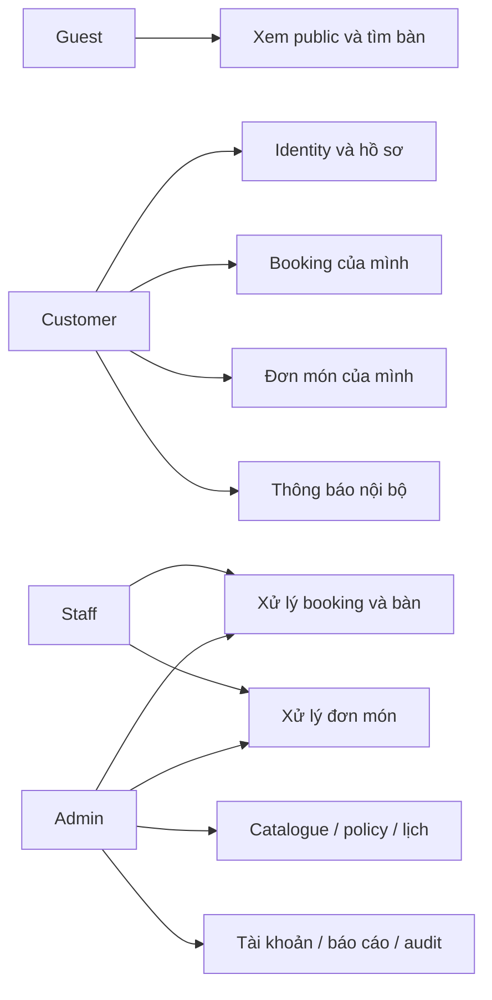
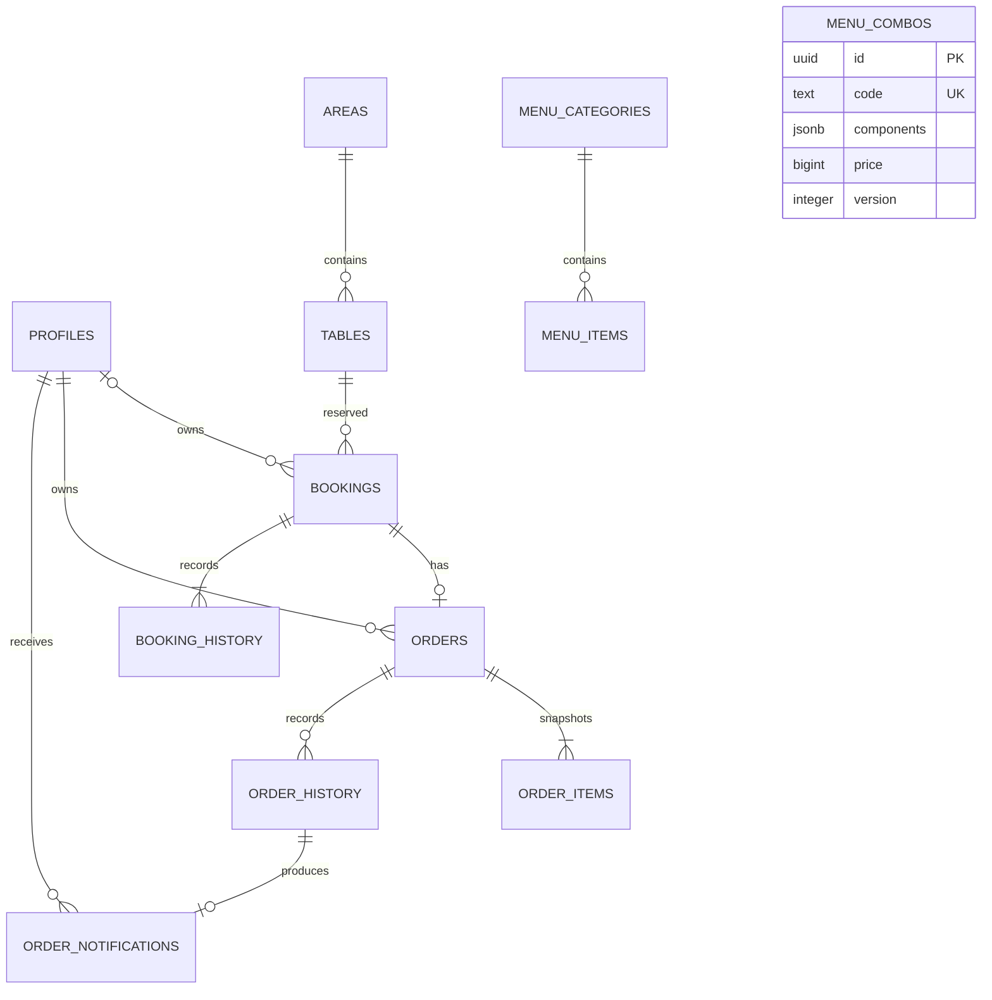
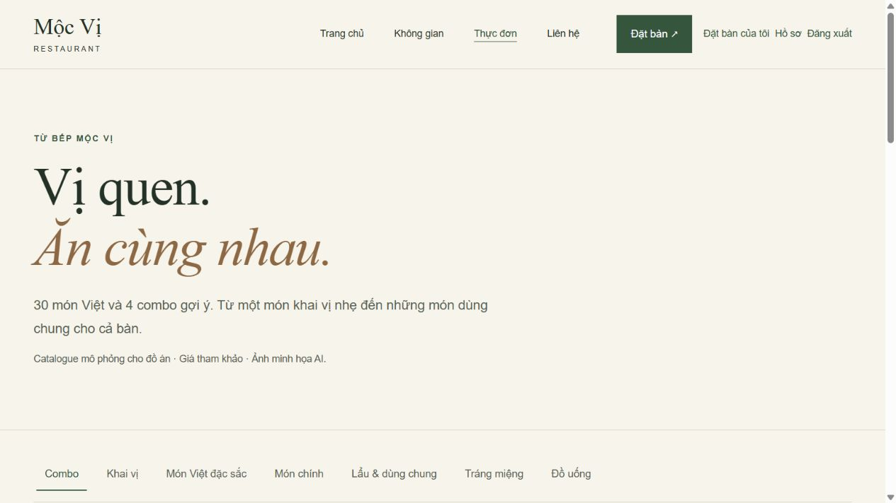
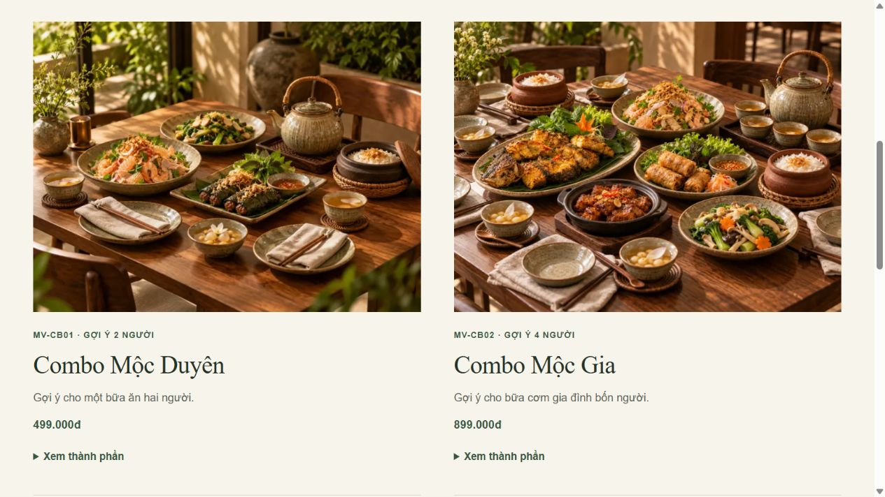
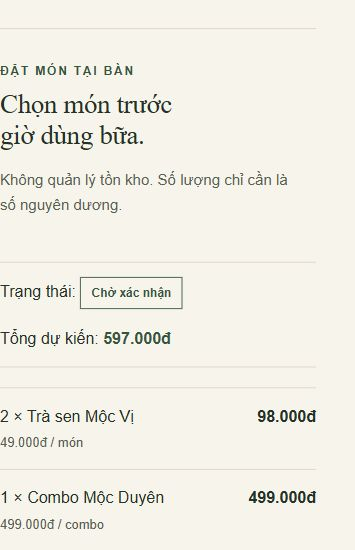
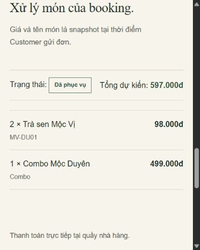

# Bàn giao đồ án — Mộc Vị Restaurant

Cập nhật 04/10/2026. Tài liệu tổng hợp phạm vi, use case, thiết kế và kịch bản
bảo vệ; không thay thế mẫu báo cáo/rubric riêng của giảng viên. Tên thành viên,
phân công và thông tin lớp cần do nhóm bổ sung vào báo cáo nộp.

## 1. Mục tiêu và phạm vi

Xây dựng website giả định cho một nhà hàng: giới thiệu, tìm/đặt bàn, đặt món
gắn booking và quản lý vận hành theo Customer/Staff/Admin. Website chính:
https://moc-vi-restaurant.vercel.app/ . GitHub Pages chỉ demo public tĩnh.

Baseline: 3 tầng, 22 bàn, 92 chỗ cấu hình, 30 món thuộc 6 danh mục, 4 combo,
50 ảnh canonical. Dữ liệu live có thể được Admin thay đổi hợp lệ; không suy
sức chứa cấu hình thành số chỗ trống. Contact không bịa địa chỉ/số điện thoại.

Ngoài phạm vi môn học đã chốt: payment gateway/đặt cọc/hoàn tiền online,
email/SMS giao dịch, kho/nguyên liệu, nhiều chi nhánh, báo cáo tài chính chuyên
sâu và disaster recovery thương mại. Giữ backup hiện có và ghi giới hạn.
3D/360 tùy chọn, không chặn bàn giao chức năng chính.

## 2. Use case và tiêu chí chấp nhận

| ID | Actor | Use case | Tiêu chí |
| --- | --- | --- | --- |
| UC01 | Guest | Xem menu/không gian/tìm bàn | Projection khả dụng không trả thông tin khách; snapshot chưa giữ chỗ |
| UC02 | Customer | Đăng ký/login/profile/recovery/logout | Trusted role; hồ sơ whitelist; recovery hợp lệ đặt mật khẩu và login lại |
| UC03 | Customer | Tạo/xem/hủy booking | Ownership; policy/thời gian database; retry không tạo event trùng |
| UC04 | Customer | Gửi/sửa/hủy đơn món | Booking owned confirmed/checked_in; chỉ sửa/hủy pending |
| UC05 | Staff/Admin | Xử lý booking | Confirm/reject/check-in/no-show/complete theo state và thời gian |
| UC06 | Staff/Admin | Xử lý đơn món | Pending → confirmed → preparing → served, hoặc cancel có lý do |
| UC07 | Staff/Admin | Vận hành bàn | Phone/walk-in, đổi bàn có consent, occupied → cleaning → available |
| UC08 | Admin | Quản lý catalogue/policy/lịch | Expected snapshot/version; audit atomic; combo archive giữ history |
| UC09 | Admin | Quản lý role/active | Self/last active Admin protection; quyền kiểm tra ở server/SQL |
| UC10 | Customer/Admin | Thông báo/báo cáo/audit | Customer chỉ nhận của mình; Admin xem báo cáo booking/audit |



Đây là bản đồ use case bằng flowchart để đọc nhanh. Actor và tiêu chí ở bảng là
nguồn cho biểu đồ UML trong mẫu báo cáo của môn nếu giảng viên yêu cầu ký pháp UML.

## 3. Quy tắc nghiệp vụ

- Một booking gắn một bàn; không ghép/tách bàn.
- Policy thời gian đọc database; không dùng đồng hồ client để quyết định.
- Website booking pending trước khi Staff xác nhận. Khả dụng không giữ chỗ.
- Một booking tối đa một đơn; tạo khi confirmed hoặc checked_in.
- Chỉ chọn món/combo active và available. Quantity nguyên dương, không quản lý
  số lượng tồn kho; giới hạn integer/total là bảo vệ kỹ thuật.
- Server lấy giá/tên/thành phần trong transaction, lưu snapshot và tính tổng.
- Customer chỉ sửa/hủy pending; expected version chống ghi đè khi Staff xác nhận.
- Served là trạng thái đã phục vụ, không phải đã thanh toán. Ghi rõ
  “Thanh toán trực tiếp tại quầy nhà hàng.”
- Booking cancelled/rejected/no_show hủy order chưa served; booking không hoàn
  tất khi order còn active. Complete đưa bàn sang cleaning; ready đưa về available.
- Ownership/RLS, role active, origin/content-type và whitelist kiểm tra ở server.
  Audit/history không bị xóa khi cleanup QA.

## 4. Thiết kế dữ liệu và luồng

Yêu cầu phi chức năng trong phạm vi đồ án:

| Yêu cầu | Cách đáp ứng / kiểm chứng |
| --- | --- |
| Bảo mật và riêng tư | Auth verified, trusted active role, RLS/ownership, same-origin, whitelist, private/no-store; test quyền A/B |
| Toàn vẹn dữ liệu | Transaction, constraints/locks, snapshot giá, idempotency, version; SQL race/rollback |
| Khả dụng giao diện | Responsive 320/704/1024/1600; nhãn, keyboard/focus, loading/error, trạng thái bằng chữ |
| Bảo trì | UI/data/live mapping tách vai trò, migration additive, contract/SQL/CI phát hiện hồi quy |
| Khả năng triển khai | Next.js/Vercel cho nghiệp vụ; Pages static demo; tài liệu chạy local và feature gate |

Không đưa SLA, số người dùng đồng thời hoặc điểm hiệu năng chưa đo vào báo cáo.

ERD đầy đủ/data dictionary: [database.md](database.md).
Kiến trúc/nguồn dữ liệu/deploy: [architecture.md](architecture.md).



MENU_COMBOS lưu JSONB thành phần được validate; không có bảng combo_items.
Order line định danh catalogue bằng type/code và snapshot, không có FK giả tới
món/combo. Danh mục thay đổi không ghi đè đơn đã đặt.

```mermaid
sequenceDiagram
  actor C as Customer
  participant W as Next.js API
  participant D as PostgreSQL RPC/RLS
  actor S as Staff
  C->>W: Tìm bàn và gửi booking
  W->>D: Auth/ownership, policy, lock, idempotency
  D-->>C: Pending booking
  S->>W: Xác nhận booking
  W->>D: Transition + history/audit
  C->>W: Gửi món/combo + quantity
  W->>D: Giá catalogue, snapshot, tổng server
  D-->>C: Pending order + version
  C->>W: Sửa pending với expected version
  W->>D: Kiểm tra conflict, snapshot lại
  S->>W: Confirm → preparing → served
  W->>D: Transition + notification/history/audit
  Note over C,S: Tổng dự kiến; thanh toán trực tiếp tại quầy
  S->>W: Check-in đúng giờ, complete, ready
  W->>D: occupied → cleaning → available
```

## 5. Ma trận kiểm thử bàn giao

Trạng thái bên dưới phân biệt bằng chứng đã có với diễn tập browser mới.
Chi tiết commit/ngày/expected/actual xem [database-testing.md](database-testing.md).
Build hoặc toast không thay thế kiểm tra persist/quyền database.

| Test | Expected | Bằng chứng hiện có |
| --- | --- | --- |
| TC01 Public/catalogue/assets | Baseline, đường dẫn/basePath và ảnh đúng | Asset/Pages checks + browser public PASS |
| TC02 Identity/recovery | Trusted active; mật khẩu mới login được | Contract; recovery/rotation operator-confirmed production |
| TC03 Booking pending | Tạo đúng một booking/event khi retry | Fresh FINAL QA HTTP + SQL read-back PASS |
| TC04 Order gate | Chưa confirm không được gửi món | Production HTTP trả 422; browser lượt 04/10 hiển thị chặn gửi món khi pending |
| TC05 Dish/combo snapshot | Tên/giá/tổng server, quantity > 0 | 86 SQL + contract + FINAL QA live PASS |
| TC06 Edit/conflict | Pending edit đạt; version cũ 409; sau confirm không sửa | SQL và production HTTP PASS |
| TC07 Ownership A/B | Không đọc/sửa booking/order/history/notification người khác | SQL RLS và live read-back; foreign booking API 404 |
| TC08 Guest/role sai | Guest 401; Customer không gọi Staff | Contract + production HTTP PASS |
| TC09 Staff lifecycle | Confirm/preparing/served persist; booking/table đúng state | SQL; order HTTP live; browser 04/10 order served và walk-in complete/ready riêng |
| TC10 Race/rollback | Không double booking/event hoặc audit dở | Database cô lập PASS; không chạy load production |
| TC11 Admin quyền/combo | Self/sole-admin giữ; create/edit/archive combo/audit | Role UI cô lập + SQL; combo browser production PASS |
| TC12 Responsive | 320/704/1024/1600, không overflow trang | Browser các view đã ghi PASS; không suy mọi thiết bị |
| TC13 Browser rehearsal | Click booking → order → Staff; complete/ready trên walk-in QA riêng | PASS theo các bước/fixture bên dưới; không suy thành một booking liên tục |
| TC14 Release | CI và Vercel đúng commit runtime/docs | CI/Vercel HEAD 78e184f đã xác minh success trước task docs |

86 nhóm SQL là kết quả gần nhất, không phải số test đã chạy lại trong task chỉ
sửa tài liệu. Fresh FINAL QA trên runtime e519787 đã cleanup booking, giữ audit.
Không công bố email, fixture IDs hoặc credential trong tài liệu công khai.

## 6. Kịch bản bảo vệ bằng giao diện

Chuẩn bị trước buổi demo:

1. Dùng Customer/Staff/Admin QA đã xác nhận, mật khẩu riêng; không ghi vào slide.
2. Chọn slot hợp lệ trong giờ phục vụ. Booking website cần lead time theo policy;
   chuẩn bị booking đủ sớm để khi demo đã vào cửa sổ check-in.
3. Kiểm tra Vercel/Supabase, feature gate combo/order và dữ liệu khả dụng.
4. Dùng ghi chú nhãn QA, dữ liệu khách giả, không thay giá/role/policy canonical.
5. Chuẩn bị ảnh/video thao tác thật dự phòng nếu mạng lỗi; ghi rõ ngày/môi trường.

Trình tự trình bày:

1. Guest xem menu, 3 tầng và tìm bàn; giải thích snapshot chưa giữ chỗ.
2. Customer tạo booking và xem trạng thái pending; chứng minh chưa đặt món được.
3. Staff xác nhận; Customer tải lại chi tiết, chọn một món + một combo rồi gửi.
4. Customer sửa quantity pending; đối chiếu tổng dự kiến và lịch sử.
5. Staff confirm → preparing → served; Customer thấy trạng thái/thông báo,
   không còn sửa online sau confirm.
6. Khi đúng cửa sổ thời gian, Staff check-in (nếu chưa check-in), complete rồi
   ready; quan sát occupied → cleaning → available.
7. Admin giới thiệu combo/catalogue/audit và báo cáo booking. Giải thích self/
   last-admin protection bằng bằng chứng môi trường cô lập, không đổi quyền thật.
8. Logout, mở private route để minh họa guard; kết thúc với giới hạn môn học.

Cleanup: chỉ booking QA của lượt này. Nếu chưa tới check-in, hủy booking khi được
phép và giữ order served/history/audit; không gán complete/ready PASS.
Nếu đã check-in, hoàn tất và dọn bàn theo workflow. Không DELETE audit.
Cleanup thất bại phải báo fixture còn active, không im lặng để pending tự biến mất.

## 7. Minh chứng và kết quả browser của lượt bàn giao

Ảnh screenshot thật lưu ngoài repo trong thư mục mocvi-academic-evidence-20261004
tại workspace. Không commit ảnh private/fixture IDs. Nhóm chọn/cắt phần dữ liệu
nhạy cảm trước khi đưa vào báo cáo lớp; không sửa trạng thái trong ảnh.

Hai ảnh public dưới đây được chụp trực tiếp từ website production ngày 04/10/2026,
không chứa thông tin khách. Ảnh đơn món chỉ chụp vùng nội dung với dữ liệu QA,
không có email, credential hoặc định danh fixture. Ảnh private đầy đủ giữ ngoài Git.









| Bước | Kết quả lượt hiện tại |
| --- | --- |
| Customer session | PASS: profile hiển thị customer |
| Tìm bàn/tạo booking | PASS browser: availability và pending booking hiện trên UI |
| Chặn order khi pending | PASS browser: “Bạn có thể gửi món sau khi booking được xác nhận.” |
| Staff confirm | PASS browser: pending → confirmed và history cập nhật |
| Customer khác mở booking | PASS browser: không tìm thấy/không thuộc tài khoản hiện tại |
| Customer create/edit | PASS browser: gửi một món + một combo, sửa món từ 1 thành 2; server-rendered tổng dự kiến và history cập nhật sau lưu |
| Staff order flow | PASS browser: confirmed → preparing → served, snapshot/tổng hiển thị giữ nguyên |
| Check-in/complete/ready | PASS browser trên một walk-in QA riêng trong giờ phục vụ; booking completed, bàn cần dọn rồi trở lại ready |
| Cleanup | PASS browser: walk-in completed/bàn ready; booking website cancelled sau order served, reload giữ trạng thái và history |

Vì booking website phải tạo trước ít nhất 60 phút và check-in chỉ mở gần giờ,
lượt này dùng hai fixture để kiểm tra các bước ngay trong giờ phục vụ. Không
gọi đây là một booking Customer liên tục đã check-in/complete; kịch bản bảo vệ
chuẩn bị booking trước vẫn cần tuân thủ thời gian. Không đổi policy/database clock.

Lượt hoàn tất ngày 04/10/2026: browser không ghi nhận console error khi kiểm tra
kết quả cuối. Chứng minh persist bằng trang server-rendered sau reload; không
gọi lượt browser này là SQL read-back/audit độc lập. Bằng chứng SQL/RLS/race
của 86 nhóm và FINAL QA trước vẫn được tham chiếu riêng.

## 8. Nội dung báo cáo nộp môn học

Từ tài liệu này và các nguồn liên kết, nhóm đưa vào mẫu giảng viên:
bối cảnh/phạm vi, yêu cầu chức năng/phi chức năng, actor/use case, ERD/data dictionary,
luồng sequence và state, kiến trúc/UI, cách triển khai, test expected/actual,
ảnh minh chứng, giới hạn và kết luận. Không bịa điểm Lighthouse, số người dùng,
tải production, tên thành viên hoặc thông tin nhà hàng thật.

Các điểm trả lời bảo vệ:
- Vì sao giá phải server tính: client có thể sửa request; snapshot giữ giá đã đặt.
- Vì sao lookup không giữ bàn: transaction tạo booking phải kiểm tra lại conflict.
- Vì sao role không lấy metadata: signup không được tự cấp quyền.
- Vì sao có version/idempotency: chống ghi đè và gửi lặp/event trùng.
- Vì sao Pages khác Vercel: static export không chạy Auth/API/database.
- Vì sao có giới hạn: phạm vi một nhà hàng giả định, không cần payment/kho/360.

Các bước diễn tập trong bảng đã đạt; nhóm có thể dùng bộ tài liệu này cho phạm vi
môn học đã chốt. Trước demo một booking liên tục, chuẩn bị trước đúng khung giờ.
Không mở thêm payment/kho/360 hoặc kiểm thử mọi thiết bị để kéo dài nghiệm thu.
