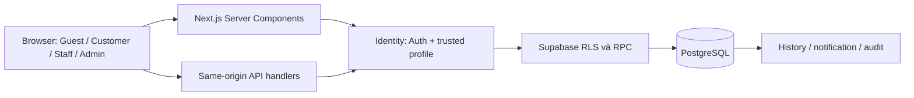

# Kiến trúc hiện hành — Mộc Vị Restaurant

Cập nhật 04/10/2026. Đây là đồ án một nhà hàng giả định, hỗ trợ đặt bàn và đặt
món/combo gắn booking. Thanh toán trực tiếp tại quầy; tổng đơn là tiền dự kiến.
Nhật ký các giai đoạn được chuyển sang [architecture-history.md](architecture-history.md).

## Vai trò và module

| Vai trò | Chức năng |
| --- | --- |
| Guest | Xem public, menu, không gian và tìm bàn khả dụng |
| Customer active | Hồ sơ/mật khẩu, booking của mình, đơn món của mình và thông báo |
| Staff active | Booking điện thoại/walk-in, xác nhận, check-in, đơn món, hoàn tất và dọn bàn |
| Admin active | Quyền Staff; policy/lịch, khu vực/bàn, món/combo, tài khoản, báo cáo booking và audit |

Public, Identity, Booking, Customer, Staff, Admin, Combo catalogue và Ordering
đã có implementation. Migration combo/order đã áp production, các feature gate
đã bật và workflow live đã nghiệm thu; xem [database-testing.md](database-testing.md).
Đổi/quên mật khẩu được operator xác nhận trên production. Không dùng kết quả
recovery để suy ra mọi loại callback email đã kiểm chứng trên production.

## Luồng ứng dụng

Server Components đọc dữ liệu bằng client Supabase theo request. Client Components
quản lý form/lựa chọn/loading rồi gọi API cùng origin; actor/role/giá không lấy
từ trình duyệt. Proxy hỗ trợ refresh cookie, response private dùng no-store.
Role và active đọc từ profiles; signup metadata không cấp Staff/Admin.

SQL thực thi policy, ownership, state machine, locks, idempotency và snapshot
trong transaction. RPC SECURITY DEFINER có search_path cố định và kiểm tra
Auth/profile; ứng dụng không được ghi trực tiếp bảng nghiệp vụ. RLS giới hạn đọc.
Database lỗi phải báo lỗi, không giả catalogue snapshot là dữ liệu live.

## Cấu trúc thực tế và nguồn dữ liệu

- src/app: public, Identity, Customer, Staff, Admin và API theo App Router.
- src/components: FloorPlan, catalogue/form và panel nghiệp vụ.
- src/lib: Identity, Supabase server client, validation, live mapping và DTO.
- src/data/restaurant.ts: baseline/codes và tọa độ canonical dùng chung.
- src/data/media.ts + src/lib/media.server.ts: mapping và kiểm tra asset.
- supabase/migrations: migration theo thứ tự; supabase/seed.sql chỉ cho baseline demo.
- scripts: contract, SQL integration, asset/Pages và QA có guard.
- .github/workflows: CI và Pages; docs: spec, bằng chứng và bàn giao.

Baseline: 3 tầng, 22 bàn, 92 chỗ cấu hình, 30 món, 4 combo, 50 ảnh canonical.
Chỗ cấu hình không phải bàn trống. Vercel đọc tên/giá/trạng thái/sức chứa/lịch live;
codes, ảnh và vị trí bàn canonical ở repo. Admin có thể thay dữ liệu vận hành hợp
lệ; không reset seed để ép production giống snapshot.

Combo live nằm trong menu_combos, thành phần là JSONB có validation; không có
bảng combo_items. Order_items lưu snapshot tên/giá/thành phần, không giữ FK giả
tới catalogue. Một booking có tối đa một đơn; Customer sửa/hủy pending. Staff
xử lý confirmed → preparing → served hoặc cancelled. Booking bị hủy/từ chối/
no-show hủy đơn chưa served; hoàn tất booking bị chặn nếu đơn còn active.

## Hai chế độ triển khai

| Chế độ | Hành vi |
| --- | --- |
| Next.js/Vercel | Auth, dữ liệu live, API booking/order và quản trị |
| GitHub Pages | Snapshot public, basePath /nhahang, form mô phỏng; không Auth/API/database |

pageExtensions tách file server và demo; Pages dùng .next-pages để giữ output riêng.
Không đưa secrets hoặc service-role vào browser/build demo.

## Kiểm thử và phạm vi đồ án

CI chạy typecheck/lint/contracts, PostgreSQL cô lập mocvi_test_*, normal build,
HTTP smoke và Pages export. 86 nhóm SQL gần nhất đạt; workflow production
Customer A/B → booking → dish/combo → Staff đạt qua HTTP và SQL read-back.
Bằng chứng browser, JWT, SQL và operator được phân biệt trong tài liệu testing.

Ngoài phạm vi: payment online, SMS/email giao dịch, kho, nhiều chi nhánh, báo cáo
tài chính chuyên sâu và disaster recovery thương mại. 3D/360 tùy chọn.
Cross-floor table move giữ khóa đến khi có coordinate được duyệt.
Chi tiết schema xem [database.md](database.md); use case/demo/test matrix xem
[academic-handover.md](academic-handover.md).
