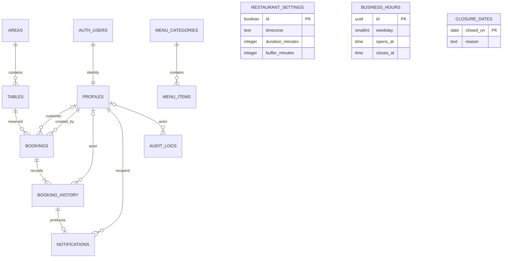

# Database và nền tảng nghiệp vụ — Phần 2

## Trạng thái và ranh giới

Migration và seed đã chạy thành công trên Supabase development và PostgreSQL
local. Bộ 18 nhóm kiểm thử tích hợp local và smoke test quyền trên Supabase đều
đạt với catalogue Phần 2 cũ (16 bàn/24 món). Seed trong repo thay đổi ở Phần 3A
sang 22 bàn/30 món. Fixture đã cập nhật, 18 nhóm test và smoke mới PASS local;
development đã sao lưu/thay seed có xác nhận, catalogue khớp UI và smoke cloud
PASS. Không coi local hoặc SQL Editor là chứng nhận tích hợp Auth/JWT thật.
Chưa cài scheduler hoặc API booking trong Next.js. Phần 4 có implementation
Identity/Auth nhưng chưa kiểm chứng Auth/JWT thật qua HTTP. Xem [database-testing.md](database-testing.md)
để biết môi trường, bằng chứng và giới hạn kiểm chứng.

SQL là nguồn thực thi chính sách duy nhất. `restaurant_settings` lưu các giá trị
chính sách; `create_booking` đọc chúng trong giao dịch. Không sao chép các con số
này thành hằng số TypeScript. Khi có UI, hiển thị chính sách từ database, đồng thời
vẫn để database kiểm tra lại mutation.

## ERD



Ba bảng cấu hình/lịch độc lập được truy vấn bởi hàm booking, không cần FK giả.
`audit_logs.entity_id` là định danh audit tổng quát, không phải FK tới booking.

## Data dictionary

Quy ước: **N** = NOT NULL; **Y** = nullable. Không ghi default nghĩa là caller
phải cung cấp (trừ cột nullable). Mọi FK đều `ON DELETE RESTRICT`; không cascade
xóa lịch sử. UUID khóa chính mặc định `gen_random_uuid()` trừ `profiles.id`.
PK/UNIQUE tự có B-tree index; index bổ sung liệt kê riêng bên dưới.

### Identity và cấu hình

| Bảng | Cột | Kiểu / null | Default, ràng buộc và ý nghĩa |
| --- | --- | --- | --- |
| profiles | id | uuid / N | PK, FK auth.users.id; không chứa mật khẩu |
| profiles | full_name | text / N | `''`, tối đa 120 ký tự |
| profiles | phone | text / Y | Tối đa 32 ký tự |
| profiles | role | app_role / N | `customer`; customer, staff, admin |
| profiles | is_active | boolean / N | true; khóa không tự hủy booking |
| profiles | created_at | timestamptz / N | now() |
| restaurant_settings | id | boolean / N | PK, true, CHECK(id): tối đa một dòng |
| restaurant_settings | name | text / N | Mộc Vị Restaurant, tên demo được duyệt |
| restaurant_settings | timezone | text / N | Chỉ Asia/Ho_Chi_Minh |
| restaurant_settings | duration_minutes | integer / N | 120, > 0 |
| restaurant_settings | buffer_minutes | integer / N | 15, >= 0 |
| restaurant_settings | min_notice_minutes | integer / N | 60, >= 0 |
| restaurant_settings | max_advance_days | integer / N | 30, > 0; một ngày = 24 giờ |
| restaurant_settings | pending_minutes | integer / N | 30, > 0, <= min_notice_minutes |
| restaurant_settings | cancellation_minutes | integer / N | 60, >= 0; thao tác hủy chưa triển khai |
| restaurant_settings | early_checkin_minutes | integer / N | 15, >= 0; thao tác check-in chưa triển khai |
| restaurant_settings | no_show_minutes | integer / N | 15, >= 0; thao tác no-show chưa triển khai |
| restaurant_settings | max_active_bookings | integer / N | 3, > 0 |
| restaurant_settings | max_guests | integer / N | 8, trong 1..8 |
| business_hours | id | uuid / N | PK |
| business_hours | weekday | smallint / N | 0 = Chủ nhật, …, 6 = Thứ bảy |
| business_hours | opens_at, closes_at | time / N | opens_at < closes_at; UNIQUE(weekday, opens_at) |
| closure_dates | closed_on | date / N | PK; ngày nghỉ theo múi giờ nhà hàng |
| closure_dates | reason | text / N | Sau trim phải dài 1..500 ký tự; nội dung công khai |

Migration tạo dòng settings duy nhất. Quyền ứng dụng không được xóa dòng đó;
DB owner vẫn có thể thay đổi dữ liệu và phải chịu trách nhiệm kiểm soát cấu hình.
Cho phép nhiều khung phục vụ/ngày, nhưng không nối các khung hoặc hỗ trợ qua đêm.
Khung giờ chồng nhau chưa có constraint riêng; chưa có API sửa lịch. Khi xây
quản trị phải kiểm tra lịch và booking hiện hữu cùng một giao dịch.

### Danh mục

| Bảng | Cột | Kiểu / null | Default và ràng buộc |
| --- | --- | --- | --- |
| areas | id, code, name | uuid, text, text / N | id PK; code UNIQUE |
| areas | is_active | boolean / N | true |
| tables | id, code | uuid, text / N | PK; code UNIQUE |
| tables | area_id | uuid / N | FK areas.id |
| tables | capacity | smallint / N | 1..8 |
| tables | status | table_status / N | available; available, occupied, cleaning, out_of_service |
| tables | is_active, description | boolean, text / N | true, `''` |
| menu_categories | id, code, name | uuid, text, text / N | PK; code UNIQUE |
| menu_categories | sort_order, is_active | integer, boolean / N | 0, true |
| menu_items | id, code | uuid, text / N | PK; code UNIQUE |
| menu_items | category_id | uuid / N | FK menu_categories.id |
| menu_items | name, description | text / N | description mặc định `''` |
| menu_items | price | numeric(12,0) / N | >= 0, đơn vị VND; không dùng float |
| menu_items | image_path | text / Y | Chưa tích hợp Storage |
| menu_items | is_available, is_active | boolean / N | true |
| menu_items | is_featured | boolean / N | false |
| menu_items | sort_order | integer / N | 0 |

Ẩn danh mục bằng `is_active=false`, không xóa bản ghi đã được tham chiếu.
`is_available=false` biểu thị món tạm hết, không nhất thiết ẩn món khỏi menu.

### Booking

| Cột | Kiểu / null | Default và ràng buộc |
| --- | --- | --- |
| id | uuid / N | PK |
| customer_id | uuid / Y | FK profiles; website bắt buộc có; phone/walk_in có thể null |
| created_by | uuid / N | FK profiles; lấy từ auth.uid(), không tin caller |
| idempotency_key | uuid / N | UNIQUE(created_by, idempotency_key) |
| request_payload | jsonb / N | Snapshot yêu cầu để kiểm tra retry; có dữ liệu liên hệ riêng tư |
| table_id | uuid / N | FK tables; đúng một bàn |
| source | booking_source / N | website, phone, walk_in |
| status | booking_status / N | pending, confirmed, checked_in, completed, cancelled, rejected, no_show |
| contact_name, contact_phone | text / N | Snapshot khi đặt; trim dài 1..120 và 1..32 |
| contact_email | text / Y | Tối đa 254; chưa xác minh định dạng/khả năng nhận email |
| notes | text / N | `''`, tối đa 1.000 ký tự |
| guest_count | smallint / N | 1..8; hàm kiểm tra thêm sức chứa và policy |
| starts_at, ends_at, blocked_until | timestamptz / N | Hữu hạn; starts_at < ends_at <= blocked_until |
| reserved_period | tstzrange / generated | [starts_at, blocked_until), tính tự động |
| service_period | tstzrange / generated | [starts_at, ends_at), tính tự động |
| expires_at | timestamptz / Y | Bắt buộc với pending, hữu hạn và <= starts_at |
| actual_guest_count | smallint / Y | 1..8; bắt buộc khi checked_in/completed |
| checked_in_at | timestamptz / Y | Bắt buộc khi checked_in/completed |
| completed_at | timestamptz / Y | Bắt buộc khi completed, >= checked_in_at |
| cancellation_source | text / Y | customer/staff/system; bắt buộc khi cancelled |
| reason | text / Y | Tối đa 500; phải khác rỗng khi cancelled/rejected |
| created_at, updated_at | timestamptz / N | now(); mutation cập nhật updated_at bằng thời gian thực |

Đây là các constraint nền tảng, không phải triển khai đủ state machine bằng
trigger. Không cấp quyền trực tiếp INSERT/UPDATE/DELETE booking cho ứng dụng.
DB owner có quyền bypass và chỉ được dùng cho migration/vận hành có kiểm soát.

### Lịch sử, thông báo, audit

| Bảng | Cột | Kiểu / null | Default và ràng buộc |
| --- | --- | --- | --- |
| booking_history | id, booking_id | uuid / N | PK; FK bookings |
| booking_history | actor_id | uuid / Y | FK profiles; null cho hệ thống |
| booking_history | from_status | booking_status / Y | null khi tạo |
| booking_history | to_status | booking_status / N | Trạng thái mới |
| booking_history | reason | text / Y | Lý do sự kiện |
| booking_history | source | text / N | customer/staff/system |
| booking_history | created_at | timestamptz / N | clock_timestamp() |
| notifications | id, recipient_id | uuid / N | PK; FK profiles |
| notifications | history_id | uuid / N | UNIQUE, FK booking_history; một thông báo/sự kiện |
| notifications | read_at | timestamptz / Y | Chủ thông báo được cập nhật |
| notifications | created_at | timestamptz / N | clock_timestamp() |
| audit_logs | id | uuid / N | PK |
| audit_logs | actor_id | uuid / Y | FK profiles; null cho hệ thống |
| audit_logs | entity_id | uuid / N | Không FK, không cascade |
| audit_logs | entity_type, action | text / N | Hiện là booking và trạng thái đích |
| audit_logs | details | jsonb / N | from/to/source/reason; không sao chép thông tin liên hệ |
| audit_logs | created_at | timestamptz / N | clock_timestamp() |

Thông báo hiện là bản ghi nội bộ trỏ tới lịch sử, **không phải gửi email**. Booking
không có Customer account chỉ sinh history/audit. History/audit không cho ứng
dụng sửa hoặc xóa.

### Index và chống trùng

- `tables_area_idx(area_id)`, `menu_items_category_idx(category_id)` cho danh mục.
- `bookings_customer_idx(customer_id, starts_at)`, `bookings_start_idx(starts_at)`.
- `bookings_pending_expiry_idx(expires_at) WHERE status='pending'`: không dùng now().
- Hai exclusion constraint GiST: `table_id = AND reserved_period &&`, và
  `customer_id = AND service_period &&` nếu customer_id khác null. Chỉ áp dụng
  pending/confirmed/checked_in. `btree_gist` cung cấp toán tử GiST cho UUID.
- `history_booking_idx(booking_id, created_at)`.
- `notifications_recipient_idx(recipient_id, created_at)`.
- `audit_entity_idx(entity_type, entity_id, created_at)`.

## Chính sách thời gian và cạnh tranh

`create_booking` lấy transaction advisory lock `(60260930,1)` rồi đọc dữ liệu
mới dưới isolation `READ COMMITTED`. Không hỗ trợ repeatable read/serializable
cho RPC này: trả `READ_COMMITTED_REQUIRED` để tránh dùng snapshot cũ sau khi chờ.
Khóa chung chấp nhận được với một nhà hàng; chưa tối ưu cho hệ thống nhiều chi
nhánh. Exclusion constraint vẫn là lớp chống trùng độc lập, không chỉ SELECT rồi
INSERT. Mọi mutation vận hành về sau phải dùng cùng thứ tự khóa trước khi đọc/ghi.

- Thời gian chuẩn `timestamptz`; lịch ngày/giờ diễn giải ở Asia/Ho_Chi_Minh.
- Thời gian xét điều kiện lấy bằng `clock_timestamp()` sau khi chờ các khóa.
- Phone/website: `start >= now + 60 phút`, `start <= now + 30 × 24 giờ`.
  Dấu bằng hợp lệ; caller nên chừa thời gian truyền request, không tính mốc sát
  biên bằng đồng hồ trình duyệt.
- Website do Customer tạo: pending; expires_at = thời điểm xử lý + 30 phút.
- Phone/walk_in chỉ Staff/Admin tạo: confirmed ngay; có thể không có account khách.
- Walk-in phải bắt đầu hiện tại: chấp nhận mốc caller trong `[now − 1 phút, now]`
  để dung sai truyền request. Đây là lựa chọn kỹ thuật, không mở rộng thành cho
  đặt trước dưới 60 phút qua website. Bàn phải `available`.
- Toàn bộ `[start, start + 120 phút + 15 phút)` phải nằm trong **một** khung mở
  cửa, cùng ngày và không phải ngày nghỉ. Bắt đầu đúng giờ mở, kết thúc buffer
  đúng giờ đóng đều hợp lệ.
- Hai booking cùng bàn tiếp giáp tại `blocked_until` được chấp nhận. Khách có
  thể đặt bàn khác tại `ends_at`; thời gian dọn bàn không phải thời gian sử dụng
  của khách. Một Customer có tối đa 3 booking active với `starts_at >= now`.
- Idempotency theo `(created_by, key)`, payload phải giống hệt (thời điểm so
  bằng epoch); retry trả bản ghi hiện tại, không tạo thêm history. Key cùng giá
  trị của người khác không trả booking của họ. Tài khoản bị khóa không được retry.
- Lỗi bất kỳ sẽ rollback booking, history, notification, audit và các expiration
  thực hiện trong cùng RPC. Lần scheduler/RPC thành công sau sẽ làm expiration lại.

`occupied/cleaning` là trạng thái vật lý hiện tại, không thay thế lịch đặt tương
lai. Không tự chuyển bàn về available khi hết 120 phút. Khách ở quá giờ cần Staff
xử lý xung đột, đổi lịch/bàn theo quy trình; chưa có thao tác check-in/complete.
Chưa có hàm tìm bàn công khai: giai đoạn sau phải trả availability đã lọc, không
được mở SELECT booking/contact cho Guest để tự tính ở trình duyệt.

## Vòng đời booking

| Chuyển trạng thái | Điều kiện | Phần 2 |
| --- | --- | --- |
| Mới → pending | Customer qua website | Đã có create_booking |
| Mới → confirmed | Staff/Admin qua phone/walk_in | Đã có create_booking |
| pending → confirmed | Staff/Admin, chưa hết hạn, bàn/khu vực hoạt động | Đã có confirm_booking |
| pending → cancelled | expires_at <= now, source=system, reason=pending_expired | Đã có expire_pending |
| pending/confirmed → cancelled | Customer chủ booking khi start − now >= 60 phút; Staff theo quyền, có lý do | Chưa có mutation |
| pending → rejected | Staff từ chối, bắt buộc lý do | Chưa có mutation |
| confirmed → checked_in | Từ start − 15 phút, bàn sẵn sàng, không xung đột; lưu số khách thực | Chưa có mutation |
| confirmed → no_show | now > start + 15 phút, chưa check-in; Staff xác nhận | Chưa có mutation |
| checked_in → completed | Staff kết thúc phục vụ, bàn chuyển cleaning | Chưa có mutation |
| confirmed → confirmed (đổi bàn) | Chưa nhận khách, khách đồng ý, bàn mới hợp lệ; phải ghi history/audit | Chưa có mutation |

Không có chuyển ngược từ trạng thái cuối. Việc dọn xong cleaning → available là
thao tác bàn riêng, không tự động theo đồng hồ. Enum/cột cho các bước chưa làm
chỉ chuẩn bị dữ liệu, không được coi là chức năng đã hoàn thành.

## Phân quyền và SECURITY DEFINER

| Dữ liệu / thao tác | Guest (anon) | Customer | Staff | Admin |
| --- | --- | --- | --- | --- |
| Settings, hours, closures | Đọc | Đọc | Đọc | Đọc |
| Areas/tables/menu active | Đọc | Đọc | Đọc | Đọc |
| Profiles | Không | Hồ sơ mình | Hồ sơ mình | Tất cả |
| Sửa full_name/phone | Không | Mình | Mình | Mình |
| Bookings/history | Không | Booking của mình | Tất cả | Tất cả |
| Notifications | Không | Của mình; cập nhật read_at | Của mình | Của mình |
| Audit | Không | Không | Không | Đọc |
| Tạo booking | Không | website | phone/walk_in | phone/walk_in |
| Xác nhận | Không | Không | Có | Có |
| Ghi trực tiếp danh mục/booking/history/audit/role | Không | Không | Không | Không |

Identity phải có `is_active=true` để đọc dữ liệu riêng tư hoặc mutation. Khóa
account vẫn giữ nguyên dữ liệu booking. Public data vẫn đọc được khi bị khóa.
Admin hiện chưa có RPC sửa danh mục hoặc cấp quyền; không giả vờ rằng role admin
đồng nghĩa mọi chức năng quản trị đã có.

Các bảng bật RLS; thu hồi default grants trước khi cấp SELECT và UPDATE theo
cột. Các helper trong `private` không phải public API. `private.current_role()`
là definer chỉ đọc role của `auth.uid()` active để tránh RLS đệ quy. Trigger
`on_signup()` chỉ tạo Customer, bỏ qua metadata role. Hai public definer
`create_booking`/`confirm_booking` kiểm tra auth/role. Tất cả definer cố định
`search_path=''`, dùng tên schema đầy đủ, không cho PUBLIC/anon EXECUTE.
Helper ghi dữ liệu là invoker, không cấp EXECUTE cho anon/authenticated.

Owner migration/Supabase service role là principal tin cậy có khả năng bypass
RLS; không dùng chúng cho request của người dùng. Không đưa service-role key lên
client. Khi cần cấp Staff/Admin trong development, operator đã xác minh user ID
mới cập nhật `profiles.role` bằng SQL owner; không có tài khoản Admin seed dùng
chung. Chưa triển khai workflow quản trị/audit việc cấp role.

## Chạy migration và seed

1. Xác định rõ Supabase project **development** và sao lưu nếu đã có dữ liệu.
   Migration này dành cho nền tảng mới; kiểm tra trùng tên bảng/enum/trigger trước.
2. Với SQL owner có quyền tạo extension/schema/trigger, chạy đúng một lần
   `supabase/migrations/202609300001_foundation.sql`. Có transaction bao toàn bộ.
   Yêu cầu PostgreSQL 15+ có `btree_gist`, schema `auth`, `auth.users`, `auth.uid()`,
   roles `anon`, `authenticated` (Supabase cung cấp).
3. Chỉ trên database demo, chạy `supabase/seed.sql`. Seed dùng mã ổn định và
upsert catalogue canonical. Để thay catalogue demo Phase 2 bằng catalogue Phase 3A,
seed chỉ xóa các mã demo cũ đã biết và sẽ từ chối chạy nếu `bookings` đã có dữ liệu;
không dùng nó để reset hoặc thay đổi môi trường có lịch sử booking.
4. Kiểm tra RLS/quyền qua tài khoản development thực tế; fixture local không thay
   thế việc kiểm thử JWT/Auth/PostgREST của Supabase.

Có thể dùng SQL Editor của project đã xác minh hoặc psql với kết nối giữ riêng
trong môi trường shell; không paste connection string/password vào Git hay chat.
Không chạy migration hai lần; không có script reset remote hoặc rollback xóa dữ
liệu. Sau khi đã áp dụng, thay đổi schema bằng migration mới.

Project `mocvi-development` đã được áp dụng migration này qua SQL Editor ngày
30/09/2026. Cách này không tự ghi lịch sử migration của Supabase CLI; nếu chuyển
sang CLI sau này, phải đối chiếu schema và ghi nhận baseline bằng quy trình
migration repair trước khi db push, tránh chạy lại migration nền tảng. Không
dựa riêng vào nhãn "Last migration" trên Dashboard để kết luận chưa có bảng.

Seed là **dữ liệu minh họa đồ án**: 3 area biểu diễn 3 tầng (Mộc Gia, Mộc Tĩnh,
Mộc Thượng), 22 bàn sức chứa 2–8 chỗ, 6 danh mục/30 món canonical, giá VND, giờ
10:00–22:00 mỗi ngày. Xem `docs/restaurant-world.md` và `docs/menu-canonical.md`
để có mã ổn định, mô hình và catalogue chuẩn. Không khẳng định đây là giờ/giá của
nhà hàng thật; seed không chứa hotline, địa chỉ, ảnh hay account. Ảnh public là
asset độc lập, không có nghĩa `menu_items.image_path` đã được tích hợp Storage.

Catalogue trong repo khớp data public: mỗi tầng có 8/8/6 bàn và 32/34/26 chỗ,
tổng 92 chỗ cấu hình. Đây không phải số chỗ khả dụng tại thời điểm đặt. Mỗi
booking vẫn chỉ một bàn, tối đa 8 khách và không vượt capacity; các điều kiện
lịch, trạng thái và quyền vẫn do SQL kiểm tra.
4 combo, tọa độ FloorPlan và tiền tố giá “Từ” chỉ nằm ở data/UI, chưa có thực thể
hoặc cột tương ứng trong schema. Không tự mở rộng database để khớp cách trình bày.
Seed là định nghĩa demo trong repo, không phải snapshot dữ liệu cloud hiện tại;
không chạy lại seed chỉ để đồng bộ tài liệu.

## Vận hành expiration

Hàm owner-only `SELECT private.expire_pending();` xử lý các pending với
`expires_at <= clock_timestamp()` và trả số dòng. Chạy lại an toàn, không sinh
history trùng. `create_booking` và `confirm_booking` cũng gọi helper này ngay
trong transaction. Confirm hết hạn trả bản ghi cancelled, **không throw** khiến
expiration bị rollback; caller phải đọc status kết quả.

Trước khi đưa chức năng booking cho người dùng, operator phải cấu hình scheduler
mỗi phút. Nếu development project đã bật extension `pg_cron`, chạy bằng owner
sau khi kiểm tra chưa có job cùng tên:

```sql
select cron.schedule(
  'mocvi-expire-pending', '* * * * *',
  'select private.expire_pending();'
);
```

Đây là hướng dẫn opt-in, **migration không tự cài extension/scheduler**. Kiểm tra
`cron.job_run_details`, cảnh báo job thất bại và thử expiration trước khi deploy.
Nếu không có scheduler, bản ghi hết hạn có thể tồn tại đến RPC thành công tiếp theo;
đồng hồ UI không giải phóng constraint. Khi có scheduler mỗi phút, trạng thái
hiển thị có thể chậm gần một phút, nhưng create/confirm luôn kiểm tra hết hạn
trước khi sử dụng hold. Không đặt private schema vào exposed schemas của API.

## Tham chiếu kỹ thuật

- [PostgreSQL: range và exclusion constraint](https://www.postgresql.org/docs/current/rangetypes.html).
- [PostgreSQL: Row Security](https://www.postgresql.org/docs/current/ddl-rowsecurity.html).
- [Supabase: database functions và search_path](https://supabase.com/docs/guides/database/functions).
- [Supabase: RLS](https://supabase.com/docs/guides/database/postgres/row-level-security).
